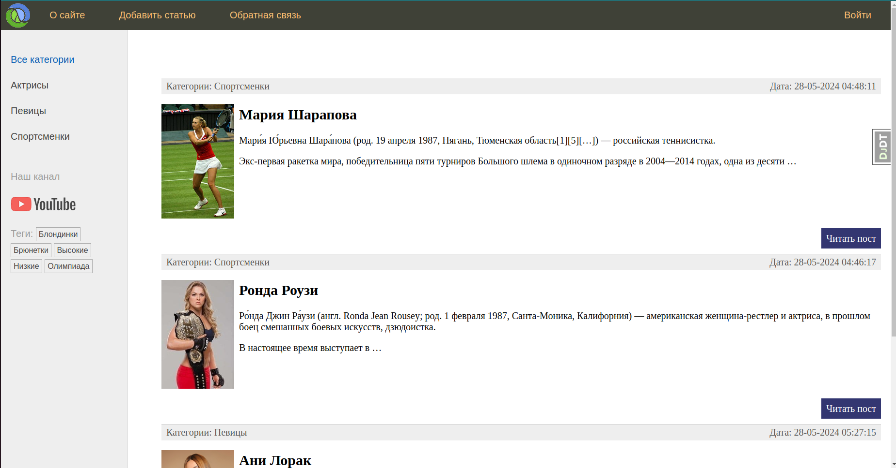
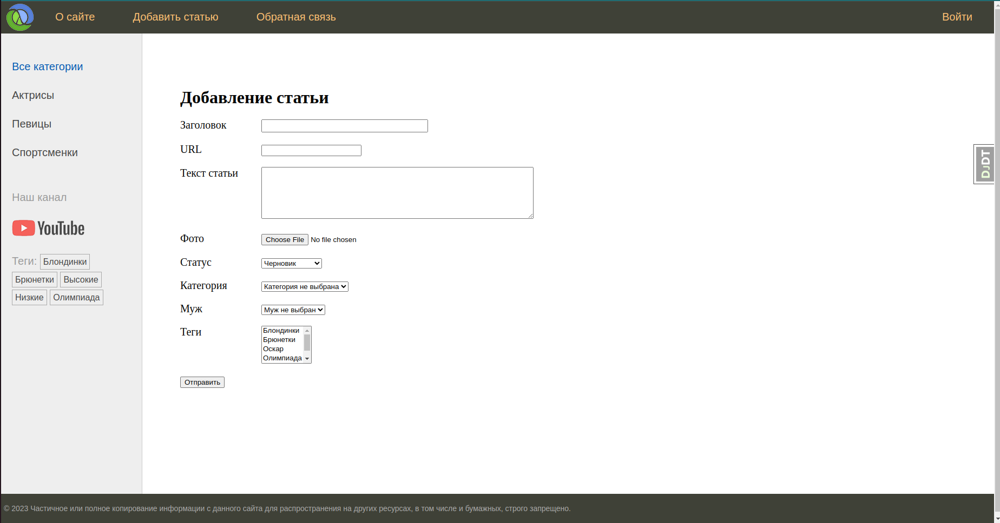
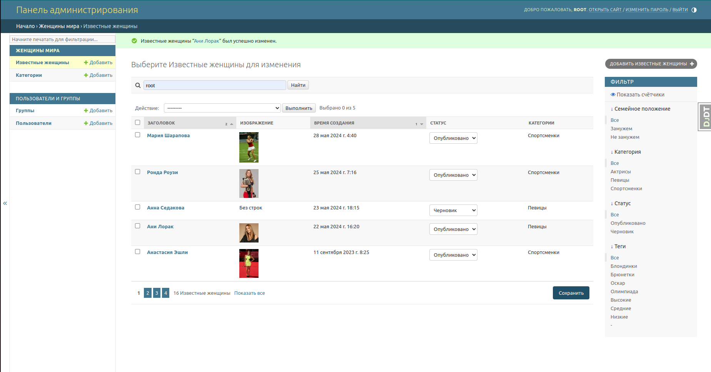
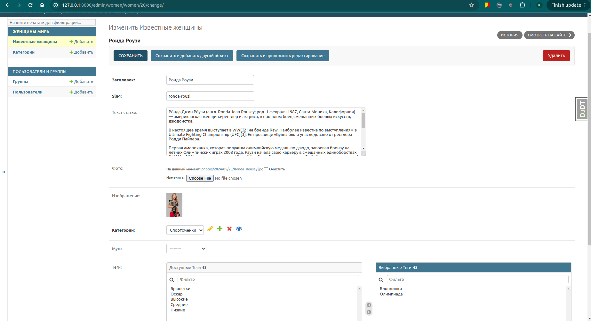

# Famous-Women

Данный проект является учебным. В нем реализуется сайт об известных женщинах. Сайт создан с помощью фреймворка Django 5.0

Главная страница

На сайте реализована фильтрация статей по категориям и тегам

Добавлять, редактировать и удалять статьи можно как на самом сайте, так и с помощью админ-панели:

